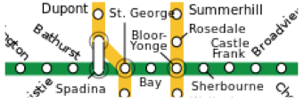

# Do people judge physical distances of locations based on their psychological orientation toward them?

## Study Description

A person’s perceived distance from a location can be affected by the actual spatial distance to that location, but by psychological factors as well. For example, the distance to the nearest gas station may seem farther when one’s car is running low on gas. In their research, Maglio and Polman (2014) sought to examine whether a person’s spatial orientation (facing toward a location vs. facing away from it) would also affect its perceived distance.

To study this, the researchers recruited 202 riders on the Toronto subway green line. All participants were recruited at the Bay subway station (see map).

Half of the participants were headed eastbound (toward Bloor-Yonge and Sherbourne) whereas the other half were headed westbound (toward St. George and Spadina). Participants were randomly assigned to indicate the subjective distance of one of the four subway stations (Bloor-Yonge, Sherbourne, St. George, or Spadina).

## Analyses

1. Open the data file (called Maglio and Polman Experiment 1). Explore the data file.

2. Perform the two-way ANOVA to test whether orientation (toward or away from) interacts with Station (Spadina, St. George, Bloor-Yonge, Sherbourne).

3. Perform follow-up tests (simple effects) to break down the significant interaction.

4. Generate a line graph to depict the interaction between orientation and station.

5. Prepare an APA-style results section to describe each of the analyses conducted above.

## DUE: April 7, 2017 at 3PM
### Upload your APA style results section and any requested tables/figures, along with your output in one file to Moodle.